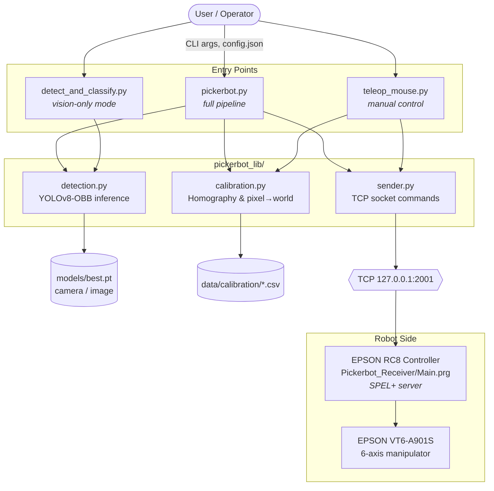

# Picker-Bot

**Developers:** Aman Mishra (M00983641), Faseeh Mohammed (M01088120)  
**Module:** PDE4435 Robot Systems Integration | **University:** Middlesex University Dubai  
**Program:** MSc Robotics

---

## Contents

- [About](#about)
- [Technical Demonstration](#technical-demonstration)
- [Codebase Structure](#codebase-structure)
- [Software Architecture](#software-architecture)
- [Content Libraries](#content-libraries)
- [Standard Operation Steps](#standard-operation-steps)
  - [Step 1 — Calibration](#step-1--calibration)
  - [Step 2 — TCP Connection](#step-2--tcp-connection)
  - [Step 3 — Detection](#step-3--detection)
  - [Step 4 — Pick Operation](#step-4--pick-operation)
- [Usage Examples](#usage-examples)
- [Command-Line Reference](#command-line-reference)
- [Configuration Reference (`config.json`)](#configuration-reference-configjson)
- [Acknowledgements](#acknowledgements)

---

## About

Picker-Bot is a computer-vision-guided pick-and-place system built around an **EPSON VT6-A901S** 6-axis industrial manipulator. It detects microelectronic modules on a work surface using a **YOLOv8 Oriented Bounding Box (OBB)** model, maps their pixel locations to real-world robot coordinates via **homography calibration**, and commands the robot to pick each module and deposit it in a collection tray — all over a **TCP/IP** socket link.

Key technologies: Python, OpenCV, Ultralytics YOLOv8, NumPy, Epson RC8 robot programming.

---

## Technical Demonstration

<a href="https://youtu.be/Rdq7Mrz8RIk" target="_blank">
  
</a>

[View Technical Presentation](https://mrrox1337.github.io/picker-bot/docs/index.html#1)

---

## Codebase Structure

```
picker-bot/
├── pickerbot.py                    # Runs the entire robotic pipeline
├── detect_and_classify.py          # Standalone detection entry point
├── teleop_mouse.py                 # Interactive mouse control entry point
├── config.json                     # Runtime configuration
│
├── pickerbot_lib/                  # Importable Python package
│   ├── __init__.py                 # Re-exports all public functions
│   ├── sender.py                   # TCP/IP robot communication module
│   ├── detection.py                # YOLOv8-OBB detection & annotation module
│   └── calibration.py              # Homography calibration & coordinate transform
│
├── tools/                          # Standalone calibration utilities
│   ├── calibration_clicker.py      # Click 77 grid points to create calibration CSV
│   ├── camera_alignment.py         # Visualise saved calibration points
│   └── sort_and_tag_pixels.py      # Sort raw pixel clicks & map world coordinates
│
├── data/
│   ├── calibration/                # Calibration data files
│   │   ├── calibration_pixels.csv          # Base 77-point pixel calibration
│   │   ├── calibration_pixels_scaled.csv   # Scaled calibration with world coordinates
│   │   └── graph_paper.jpg                 # Calibration grid target image (1280x720)
│   └── test-samples/               # Test images for offline development
│       ├── ruler.jpg               # Ruler image for height recalibration
│       └── *.jpg                   # Sample detection images
│
├── models/
│   ├── best.pt                     # YOLOv8-OBB model for module detection
│   ├── cw_keras/                   # (Legacy) Keras classifier — 5 classes
│   └── pir_daytime_sample_model/   # (Legacy) Keras classifier — 3 classes
│
├── Epson/
│   └── Pickerbot_Receiver/         # Robot-side program (Epson RC8)
│       └── Main.prg                # TCP listener — executes JUMP/GO/MOVE/PICK/STANDBY
│
├── legacy/                         # Superseded scripts kept for reference
│   ├── main_orchestrator.py        # Earlier monolithic orchestration script
│   ├── keras_inference.py          # Keras classification module
│   └── cv_discovery.py             # Threshold-based contour detection
│
├── LICENSE
└── README.md
```

| Folder           | Purpose                                                                                    |
| ---------------- | ------------------------------------------------------------------------------------------ |
| `pickerbot_lib/` | Importable package containing the detection, calibration, and robot communication modules. |
| `tools/`         | Standalone utility scripts for one-time calibration setup tasks.                           |
| `data/`          | All non-code assets — calibration CSVs, reference images, and test samples.                |
| `models/`        | Trained model weights. `best.pt` is the active YOLOv8-OBB model.                           |
| `Epson/`         | Robot-side Epson RC8 program that listens for TCP commands and drives the manipulator.     |
| `legacy/`        | Superseded scripts kept for reference. Not used in the current pipeline.                   |

---

## Software Architecture

The system is organised around three runnable entry points, a single importable support package (`pickerbot_lib`), and an external robot controller reached over TCP/IP. The diagram below shows the runtime relationship between these components and the external resources they consume.



Data flows from the operator down through the entry points, which parse configuration and command-line arguments and delegate vision, calibration, and transport work to the three modules inside `pickerbot_lib`. These modules collectively produce the TCP command stream consumed by the SPEL+ server running on the EPSON RC8 controller, which in turn drives the VT6-A901S manipulator.

---

## Content Libraries

The `pickerbot_lib` package is designed to be imported by the entry-point scripts and can also be used directly:

```python
from pickerbot_lib import connect, detect_and_annotate, load_calibration_data
```

### `pickerbot_lib.sender` — Robot TCP Interface

Manages the TCP/IP socket connection to the EPSON controller.

| Function                  | Description                                               |
| ------------------------- | --------------------------------------------------------- |
| `connect(ip, port)`       | Opens a TCP socket to the robot controller.               |
| `disconnect()`            | Closes the socket.                                        |
| `epsonGo(x, y, z, u)`     | Sends a GO (linear move) command.                         |
| `epsonJump(x, y, z, u)`   | Sends a JUMP command.                                     |
| `epsonMove(x, y, z, u)`   | Sends a MOVE command.                                     |
| `epsonPick(x, y, z, u)`   | Sends a PICK command (move + grip + deposit).             |
| `epsonStandby()`          | Returns the robot to its home position.                   |
| `epsonPickAll(locations)` | Batch-picks a list of locations; aborts on first failure. |

### `pickerbot_lib.detection` — YOLO Detection Module

Wraps the YOLOv8-OBB model for inference and annotation.

| Function                                 | Description                                                                                                                                                 |
| ---------------------------------------- | ----------------------------------------------------------------------------------------------------------------------------------------------------------- |
| `detect_and_annotate(frame, confidence)` | Runs detection on a frame. Returns `(annotated_frame, detections)` where each detection is `(cx, cy, angle, label, conf)`. Filters out the `"noise"` class. |

### `pickerbot_lib.calibration` — Calibration Utilities

Provides homography calibration loading and the height-recalibration GUI.

| Function                                 | Description                                                              |
| ---------------------------------------- | ------------------------------------------------------------------------ |
| `load_calibration_data(csv_filename)`    | Loads pixel and world coordinate arrays from a calibration CSV.          |
| `calculate_homography(src_pts, dst_pts)` | Computes a homography matrix from point correspondences.                 |
| `pixel_to_world(H, pixel_x, pixel_y)`    | Transforms a pixel coordinate to world coordinates using the homography. |
| `run_calibration_gui()`                  | Opens the ruler-based height recalibration GUI.                          |

### `legacy/keras_inference.py` — Keras Classifier

Provides `ModuleClassifier(model_dir)` which loads a Keras `.h5` model and `labels.txt`. Call `.predict(cv2_image)` to get `(label, confidence)`. Compatible with Google Teachable Machine exports.

---

## Standard Operation Steps

The typical workflow follows four stages: **Calibration**, **TCP Connection**, **Detection**, and **Pick Operation**.

### Step 1 — Calibration

Calibration maps pixel coordinates from the camera image to real-world millimetre coordinates on the work surface using a 77-point homography grid (11 columns x 7 rows, 20 mm spacing).

**Initial setup (one-time):**

1. Capture `graph_paper.jpg` with the camera positioned over the calibration grid and place it in `data/calibration/`.
2. Click all 77 grid intersections using the calibration clicker tool:

   ```bash
   python tools/calibration_clicker.py
   ```

   This produces `data/calibration/calibration_pixels.csv`.

3. Run the sorting and mapping script to add world coordinates:

   ```bash
   python tools/sort_and_tag_pixels.py
   ```

4. (Optional) Verify the points visually:
   ```bash
   python tools/camera_alignment.py
   ```

**Height recalibration (when camera height changes):**

```bash
python pickerbot.py --calibrate
```

This opens a GUI where you click two points 20 mm apart on `ruler.jpg`. The script computes a scale factor, rescales all 77 calibration points, saves the result to `data/calibration/calibration_pixels_scaled.csv`, and updates `config.json`.

### Step 2 — TCP Connection

Configure the connection in `config.json`:

```json
{
  "enable_epson_tcp": true,
  "epson_ip": "192.168.150.2",
  "epson_port": 2001
}
```

| Setting            | Description                                                                                      |
| ------------------ | ------------------------------------------------------------------------------------------------ |
| `enable_epson_tcp` | Set `true` to send commands to the robot. When `false`, detection runs but no commands are sent. |
| `epson_ip`         | `127.0.0.1` for the EPSON simulator, `192.168.150.2` for the physical robot.                     |
| `epson_port`       | TCP port (default `2001`).                                                                       |

On the robot side, deploy `Epson/Pickerbot_Receiver/Main.prg` to the controller. The program starts a TCP server, listens for commands, and executes them.

### Step 3 — Detection

Detection uses the YOLOv8-OBB model (`models/best.pt`) to locate microelectronic modules and estimate their orientation angle.

- **Live camera:** Set `"input_mode": "webcam"` (or `"camera"`) and `"webcam_id": 1` in `config.json`.
- **Static image:** Set `"input_mode": "image"` and `"test_image_path": "data/test-samples/<filename>"`.

The confidence threshold is controlled by `"min_confidence"` (default `0.65`).

### Step 4 — Pick Operation

Once detections are obtained, `pickerbot.py` converts each pixel centroid to world coordinates using the homography matrix, then sends batch PICK commands to the robot via TCP. Each PICK triggers the following sequence on the manipulator:

1. Lift to clearance height
2. Move above the target (x, y)
3. Descend to pick height (z) with rotation (u)
4. Activate gripper
5. Lift and move to deposit tray
6. Release gripper
7. Return to standby

---

## Usage Examples

### Run the full pipeline (camera input)

```bash
python pickerbot.py --src camera
```

### Run the full pipeline (image input)

```bash
python pickerbot.py --src data/test-samples/31.jpg
```

### Run height recalibration only

```bash
python pickerbot.py --calibrate
```

### Run standalone detection on an image

```bash
python detect_and_classify.py data/test-samples/31.jpg
```

### Run standalone detection on the live camera

```bash
python detect_and_classify.py
```

### Interactive mouse control (teleop)

Click anywhere on the calibration image to move the robot to that world coordinate:

```bash
python teleop_mouse.py
```

Press `q` to quit.

### Calibration tools

```bash
python tools/calibration_clicker.py     # Click 77 grid points on graph_paper.jpg
python tools/sort_and_tag_pixels.py     # Sort points and map world coordinates
python tools/camera_alignment.py        # Visualise saved calibration points
```

---

## Command-Line Reference

### `pickerbot.py`

| Argument      | Default                | Description                                                                                                                                                    |
| ------------- | ---------------------- | -------------------------------------------------------------------------------------------------------------------------------------------------------------- |
| `--src`       | _(from `config.json`)_ | Input source. Use `"camera"` for live feed or provide a path to an image file. Falls back to `input_mode` / `test_image_path` from `config.json` when omitted. |
| `--calibrate` | off                    | Run the height recalibration GUI and exit.                                                                                                                     |

### `detect_and_classify.py`

| Argument                | Default                | Description                                                                               |
| ----------------------- | ---------------------- | ----------------------------------------------------------------------------------------- |
| positional `image_path` | _(none — uses camera)_ | Path to an image file. If omitted, opens the live camera feed with a confidence trackbar. |

---

## Configuration Reference (`config.json`)

| Key                | Type   | Default                                            | Description                                                                                                          |
| ------------------ | ------ | -------------------------------------------------- | -------------------------------------------------------------------------------------------------------------------- |
| `input_mode`       | string | `"webcam"`                                         | Input source when `--src` is not passed. `"webcam"` or `"camera"` for live feed; `"image"` to use `test_image_path`. |
| `webcam_id`        | int    | `1`                                                | Camera device index (`0` = built-in, `1` = first USB camera).                                                        |
| `test_image_path`  | string | `"data/test-samples/14.jpg"`                       | Path to the test image when `input_mode` is `"image"`.                                                               |
| `min_confidence`   | float  | `0.65`                                             | YOLO detection confidence threshold (0.0–1.0).                                                                       |
| `enable_epson_tcp` | bool   | `false`                                            | Enable/disable TCP commands to the robot.                                                                            |
| `epson_ip`         | string | `"127.0.0.1"`                                      | Robot controller IP address.                                                                                         |
| `epson_port`       | int    | `2001`                                             | Robot controller TCP port.                                                                                           |
| `robot_z`          | int    | `360`                                              | Default Z-axis pick height in mm.                                                                                    |
| `calibration_file` | string | `"data/calibration/calibration_pixels_scaled.csv"` | Path to the active calibration CSV.                                                                                  |
| `teleop_image`     | string | `"data/calibration/graph_paper.jpg"`               | Background image shown in the `teleop_mouse.py` click UI. Set to any image that matches the calibration surface.    |

---

## Acknowledgements

**Dr. Judhi Presetyo** — provided the initial EPSON TCP template script that formed the basis of the robot communication layer.

**EPSON SPEL+ Language Reference Manual** — primary reference for the SPEL+ command set used in `Epson/Pickerbot_Receiver/Main.prg`.

**Bilal Baslar** — recommended YOLOv8-OBB as the detection approach for Phase 2, replacing the earlier threshold-based contour method.

**Claude (Anthropic)** — code refactor support: centralising `config.json` usage across all entry points and library modules, librarising key components into the importable `pickerbot_lib` package, and removing redundant hardcoded values.
